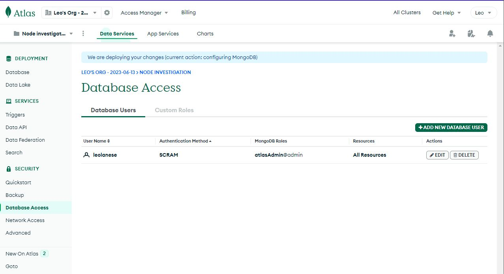
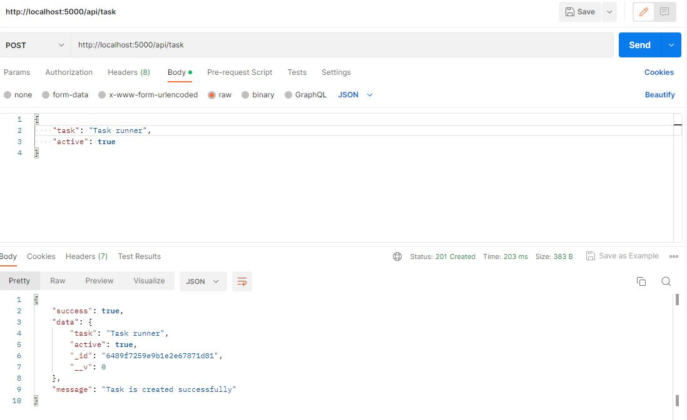
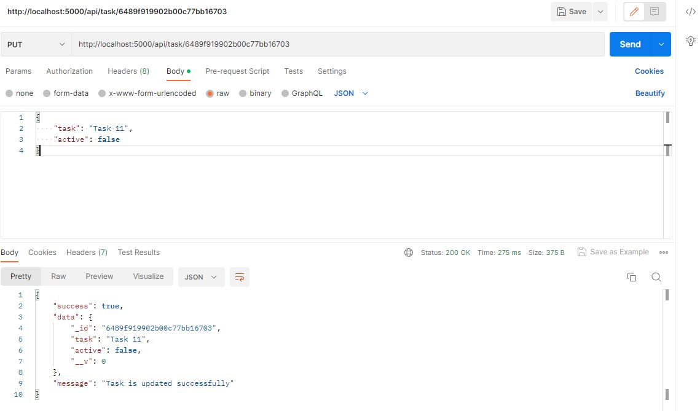
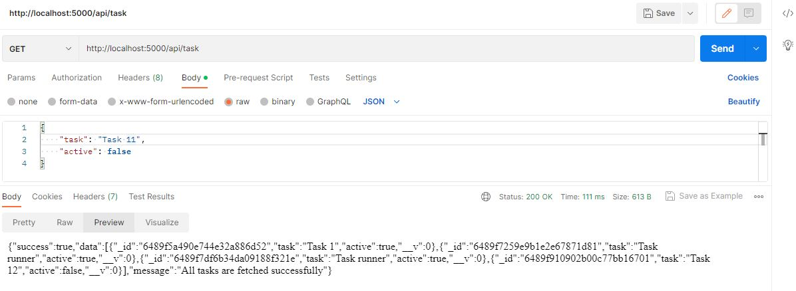
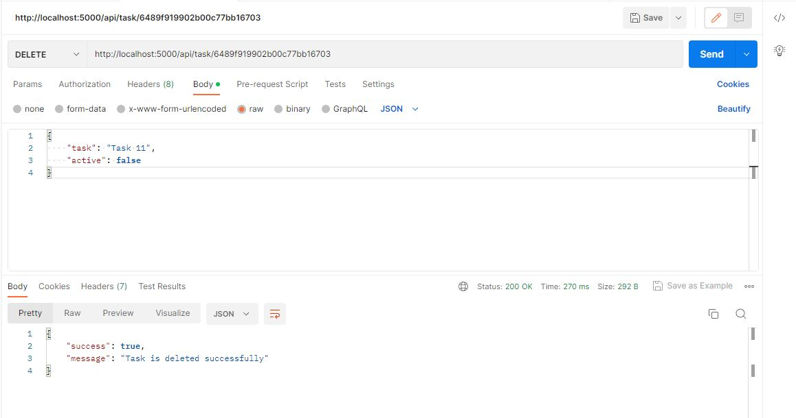

# NodeJS Todo List

> Building a RESTful API With NodeJS, Express, & MongoDB

```js
npm init

npm i express dotenv colors morgan express-async-handler

npm i -D nodemon
```

## Install MongoDB

```js
npm i mongodb

npm i mongoose

npm list mongodb
nodejs_todo_list@1.0.0 C:\Users\lanes\dev\nodejs_todo_list
├── mongodb@5.6.0
└─┬ mongoose@7.2.4
  └── mongodb@5.5.0
```

---

## DB access

> The easiest way to get up and running is to use MongoDb Atlas. Atlas is a DBaaS, DB as a service.

Copy from DataBase Access, edit user and use it into env.

## IP Access List Entry

You will only be able to connect to your cluster from the following list of IP Addresses



---

## Error connecting to MongoDB MongoServerError: bad auth : authentication failed

The error bad auth: authentication failed is indicating that the MongoDB server was unable to authenticate the user with the provided credentials. This error can occur due to a few reasons: Incorrect credentials, privileges or Incorrect database

### Connecting to server cluster

```js
> npm run dev

> nodejs_todo_list@1.0.0 dev
> nodemon server

[nodemon] 2.0.22
[nodemon] to restart at any time, enter `rs`
[nodemon] watching path(s): *.*
[nodemon] watching extensions: js,mjs,json
[nodemon] starting `node server.js`
Server is running on port: 5000
MongoDB connected: ac-okc09tz-shard-00-02.ooedapl.mongodb.net
...
```

```js
// going to: localhost:5000
YAY! API is running good
```

---

## Testing API Requests/Responses

### Test POST



### Test PUT



## Test GET



### Test DELETE



---
### :100: <i>Thanks!</i>
#### Now, don't be an stranger. Let's stay in touch!

##### :radio_button: linkedin: <a href="https://www.linkedin.com/in/leolanese/" target="_blank">@LeoLanese</a>
##### :radio_button: Twitter: <a href="https://twitter.com/LeoLanese" target="_blank">@LeoLanese</a>
##### :radio_button: Portfolio: <a href="https://www.leolanese.com" target="_blank">www.leolanese.com</a>
##### :radio_button: DEV.to: <a href="https://www.dev.to/leolanese" target="_blank">dev.to/leolanese</a>
##### :radio_button: Blog: <a href="https://www.leolanese.com/blog" target="_blank">leolanese.com/blog</a>
##### :radio_button: Questions / Suggestion / Recommendation: developer@leolanese.com
